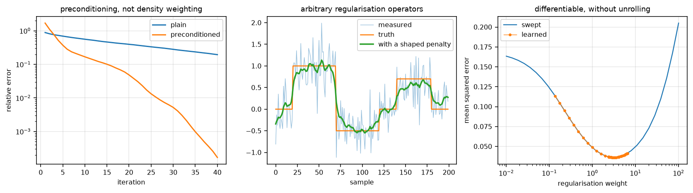

# torchsolve

Iteratively regularised Gauss-Newton for nonlinear inversion, and the inner
solvers it needs -- written to spend as little memory per iteration as the
arithmetic allows, and differentiable without storing one.

[](https://github.com/FiRMLAB-Pisa/torchsolve/actions/workflows/test-ci.yml)
[](https://codecov.io/gh/FiRMLAB-Pisa/torchsolve)
[](https://pypi.org/project/torchsolve/)
[](LICENSE)

Fit a nonlinear model, or invert one, by linearising about the current estimate
and solving the regularised linear problem that gives:

$$\big(DF^H DF + \alpha\big)(x - x_\text{ref}) = DF^H\big(y - F(x) + DF(x - x_\text{ref})\big),$$

then decreasing $\alpha$ and repeating. The regularisation starts strong, which
keeps the first steps from chasing a linearisation that is only locally true,
and is relaxed geometrically as the estimate improves. **That schedule is the
method** -- a Gauss-Newton step at fixed regularisation is something else.

This follows BART's `irgnm2` in `src/iter/italgos.c`, which solves for
$x - x_\text{ref}$ rather than for the update, at the cost of one extra
derivative call, so the inner solve is an ordinary regularised least-squares
problem that any solver can do.



- **The inner solver is a seam, not a menu** — anything that maps a
  `LinearProblem` to a step will do, so an ADMM or proximal solver belongs to
  whoever needs it rather than to this package. Two are supplied: `CGSolver`
  for a matrix-free problem, `LstsqSolver` for a small dense one
- **One $\alpha$ governs every regularisation term**, which is what makes the
  schedule a schedule. Terms carry weights *relative* to it, so a single scalar
  still drives several penalties
- **Any number of terms** — each with its own linear operator (identity by
  default, and then folded into a scalar rather than applied) and its own bias,
  which relocates what the term pulls towards
- **Constraints are a change of variables, not a solver feature** — see below
- **CG steps through negative curvature** — a compressed Toeplitz normal
  carries eigenvalues just below zero, and a `pAp > 0` guard stops on them and
  leaves the residual where it was. BART stops only on an exactly zero
  curvature; so does this
- **Preconditioning instead of density compensation** — the weighting belongs
  in the solver, where it changes only the path taken, rather than in the data,
  where it changes which problem is solved
- **Differentiable without unrolling** — a gradient reaching the solution
  reaches the right-hand side, and anything the operator closed over, through
  one more solve. Memory is flat in the iteration count

## Constraints

A bound and an equality are both changes of variable, so both are exact, cost
nothing, and reach the solver as an ordinary unconstrained problem:

```python
# non-negative: fit the logarithm
gauss_newton(lambda log_p: model(log_p.exp()), data, start)

# w + f = 1: one free parameter fewer, and the sum holds by construction
def two_pool(f):
    return (1 - f) * fast(f) + f * slow(f)
```

What they change is the geometry the step is taken in, which is usually a help
and occasionally a hindrance: $\theta^2$ has a vanishing derivative at zero, so
an estimate driven to the bound stops moving; $e^\theta$ does not, but cannot
reach zero. What genuinely needs more than this is a non-smooth penalty or a
constraint coupling many parameters at once -- and that is what the solver seam
is for, rather than something this package should grow.

## Memory

Twenty CG iterations on a 192³ complex volume, one RTX 4060 Laptop GPU:

| | peak | |
|---|---|---|
| `torchsolve` | 216 MiB | **4.0 volumes**, 166 ms |
| the implementation it replaces | 432 MiB | 8.0 volumes, 254 ms |

The difference is how the arithmetic is written. `torch.vdot` and a batched
`einsum` take an inner product without materialising it;
`(a.conj() * b).real.sum()` costs two whole volumes and `torch.linalg.vecdot`
costs the same. The updates are `addcmul_` and `mul_`, not `x = x + a * p`.
What is left is the four the algorithm needs.

## Quick Start

```bash
pip install torchsolve
```

```python
import torch
from torchsolve import CGSolver, LstsqSolver, Regularizer, gauss_newton

# a nonlinear fit: the derivatives come from autograd unless you supply them
found = gauss_newton(model, data, start, iterations=8, alpha=1.0, reduction=2.0)
found.solution, found.residual_norms, found.alphas

# a small dense problem, every voxel solved at once
found = gauss_newton(model, data, start, solver=LstsqSolver(), batch_dims=1)

# a matrix-free one, and the regularisation the schedule scales
found = gauss_newton(
    model, data, start,
    solver=CGSolver(max_iter=100, rtol=1e-4, preconditioner=weighting),
    regularizers=[Regularizer(1.0), Regularizer(0.5, operator=gradient, adjoint=divergence)],
)

# or hand it a solver this package has never heard of
found = gauss_newton(model, data, start, solver=my_admm)
```

The linear solver is usable on its own:

```python
from torchsolve import conjugate_gradient

result = conjugate_gradient(normal, rhs, regularizers=[...], preconditioner=...,
                            batch_dim=0, parameters=[weight])
result.solution.pow(2).sum().backward()
```

## Examples

| | |
|---|---|
| [`preconditioning.py`](examples/preconditioning.py) | A badly scaled operator, and what Jacobi buys without touching the data |
| [`regularised_solve.py`](examples/regularised_solve.py) | A shaped penalty and a bias, on a noisy staircase |
| [`differentiable_weight.py`](examples/differentiable_weight.py) | Learning the regularisation weight, checked against a sweep |
| [`make_showcase.py`](examples/make_showcase.py) | The figure above |

## Related Works

- **BART** — <https://mrirecon.github.io/bart/>. Its `conjgrad` in
  `src/iter/italgos.c` is the reference this follows, including the decision to
  stop only on an exactly zero curvature. `tests/test_cg.py` transcribes it and
  checks the two agree.
- **MIRTorch** — <https://github.com/guanhuaw/MIRTorch>. Where the
  differentiate-the-solve-not-the-iterations approach comes from. Its CG gates
  on positive curvature, which is the behaviour this deliberately does not
  copy.
- **SigPy** — <https://github.com/mikgroup/sigpy>. `sigpy.alg.ConjugateGradient`
  for the same problem in NumPy and CuPy.
- Hestenes MR, Stiefel E. *Methods of conjugate gradients for solving linear
  systems.* J Res Natl Bur Stand 1952;49:409-436.
- Pruessmann KP, Weiger M, Börnert P, Boesiger P. *Advances in sensitivity
  encoding with arbitrary k-space trajectories.* Magn Reson Med 2001;46:638-651.
  Why a non-Cartesian reconstruction wants the normal operator and a
  preconditioner rather than a density-weighted adjoint.

## Development

```bash
pip install -e .[dev]
bash scripts/format_and_lint.sh
pytest -q
```

The docstring examples run as part of the suite — they are the documentation,
and an example that has drifted is a broken one. See
[CONTRIBUTING.md](CONTRIBUTING.md).
